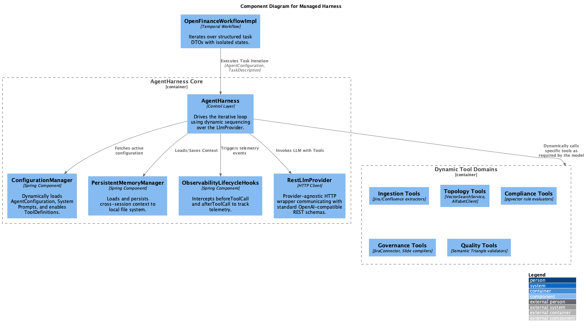

# X_Bank Agent-Native Architecture Framework (Version 2.0)

<p align="center">
  
  
  
  
</p>

Welcome to the **X_Bank Agent-Native Architecture Framework**, a production-grade, highly governed, autonomous architectural system. This repository maps the implementation of an AI-driven Software Development Life Cycle (SDLC), utilizing specialized autonomous agents to ingest product requirements, map logical topologies, enforce strict regulatory guardrails, and generate deployment artifacts.

---

## 🏛 The Core Paradigm: Agent = Model + Harness

At X_Bank, we do not deploy raw Large Language Models (LLMs) into production. Instead, we adhere to the **LFI-Sandwich Architecture**, wrapping stateless LLM compute inside a highly secure and deterministic **Cognitive Orchestration Harness**. 

### The Three Layers of Agent Engineering
*   **Prompt Engineering**: This layer establishes the agent's identity and persona. It functions as the foundational instruction set that tells the agent who they are and how they should behave. 
*   **Context Engineering**: This layer manages memory and information efficiency. It utilizes techniques such as RAG (Retrieval-Augmented Generation), tool calling, and MCP to load relevant data and manage the context window effectively. 
*   **Harness Engineering**: This is an orchestration layer that moves beyond simple input/output. It creates a controlled environment for the agent, implementing strict rules, iterative loops, and step-by-step task management to ensure complex, long-duration projects are completed accurately. 

### Harnessing Layer Deep Dive: The Ralph Architecture & Managed Harness
This framework is built upon the primary example of successful harness engineering known as **The Ralph Architecture** and deployed using a **Managed Harness** pattern:
*   **Structured Requirements**: The process begins by generating a comprehensive product requirement document, which the `RequirementOrchestratorActivities` converts into structured JSON tasks.
*   **Iterative Looping**: Instead of a single-shot approach, the system enters a loop where it selects, executes, tests, and documents only one specific task at a time.
*   **Isolated State Management**: Each iteration provides the agent with a fresh, clean set of both prompts and context, preventing memory degradation.
*   **Managed Harness (Configuration-Driven)**: Instead of rigid logic, agents are dynamically configured via API payloads (`AgentConfiguration`). The Harness handles generic tool execution, cross-session memory (`PersistentMemoryManager`), and provider agnosticism (`RestLlmProvider`).

The equation is simple: **`Agent = Model + Managed Harness + Dynamic Tools`**


This ensures that the AI cannot hallucinate outside of strict regulatory boundaries, specifically conforming to:
- **CBUAE Circular 3/2025 (Open Finance)**
- **PCI-DSS v4 (Cardholder Data Environments)**
- **GDPR (Data Privacy & PII)**
- **FAPI2 (Financial-grade API Security)**

---

## 🤖 The Dynamic Tool Domains
Previously, the E2E execution was decoupled into 5 rigid sequential agents. Under the new Managed Harness pattern, these are now **Dynamic Tool Domains**. The central `AgentHarness` autonomously selects tools from these domains based on the current isolated task:



1. **Ingestion Tools**: Parses Jira/Confluence webhooks to extract structured BIAN boundaries.
2. **Topology Tools (`VectorSearchService`, `AlfabetClient`)**: Queries live CMDB APIs and vector databases to synthesize low-level designs.
3. **Compliance Tools**: Intercepts designs, auditing against `pgvector` rules. Acts as a Cognitive Circuit Breaker.
4. **Governance Tools (`JiraConnector`)**: Manages RBAC and creates tickets for Human-in-the-Loop (HITL) CAB approvals.
5. **Quality Tools**: Calculates DORA metrics and tracks Workload Amplification via Semantic Triangle checks.

---

### 🚀 Java Spring Boot Orchestration
The Cognitive Harness is now fully codified in Java, utilizing dynamic sequencing:
- **`OpenFinanceWorkflowImpl.java`**: Temporal event-loop driving the iterative Ralph task execution.
- **`AgentHarness.java`**: The core control layer executing dynamic tool-calling via `RestLlmProvider`.
- **`ObservabilityLifecycleHooks.java`**: Injects `TraceLogger` and `TokenTracker` around every tool execution.

### 📊 Strategic SWOT Analysis
Please refer to the `x_bank-core/8_togaf_agile_radar...` document for the **3-Year TCO CapEx/OpEx breakdown** and the strategic Agentive SWOT Analysis (mitigating GPU hardware costs and TTFT constraints).


## 🏗 Enterprise Technology Stack
This repository defines the following enterprise infrastructure:
- **Java / Spring Boot**: The core runtime for the Cognitive Orchestration Harness, organized into a **Hexagonal (Ports & Adapters)** Domain-Driven Design.
- **Kong Agent Gateway**: The ingress routing layer, embedded with a **Security LLM** to block prompt injections before they reach the orchestration layer.
- **Temporal & Kafka (MSK)**: The stateful multi-agent workflow engine orchestrating deterministic event loops between the agents.
- **Distributed Cache & Data**: An active-active clustered `Redis` for semantic vector caching and a replicated High-Availability `pgvector` PostgreSQL instance for state retention.
- **Kubernetes & OpenShift**: Workloads are deployed with strict `podAntiAffinity` for active-active redundancy and rolling updates.
- **gVisor / WasmEdge**: The WebAssembly (WASM) execution environment providing strict memory sandboxing for the agents.

---

## 📂 Code Directory Tree
This repository models the standard Maven/Spring Boot project layout of our autonomous framework.

```text
x_bank-agent-native-architecture-framework-v2/
├── src/main/java/com/xbank/harness/
│   ├── ingestion/                          # Ingestion Domain Context (Agent 1)
│   ├── topology/                           # Topology Domain Context (Agent 2)
│   ├── compliance/                         # Compliance Domain Context (Agent 3)
│   ├── governance/                         # Governance Domain Context (Agent 4)
│   ├── quality/                            # Quality Domain Context (Agent 5)
│   ├── orchestration/                      # Stateful Temporal Workflow Orchestration
├── infrastructure/k8s/                     # Active-Active OpenShift manifests
│   ├── 00-namespace.yaml
│   ├── 01-deployment.yaml                  # Includes PodAntiAffinity
│   ├── 02-service.yaml
│   ├── 03-route.yaml
│   ├── 04-redis-ha.yaml                    # StatefulSet for Distributed Cache
│   └── 05-postgres-ha.yaml                 # StatefulSet for Distributed Data
├── data/                                   # Database Migrations
│   ├── migrations/                         # Flyway schemas
│   └── seed_regulations.sql                # Vector rules database seed values
├── scripts/                                # Maintenance & Pipeline Hooks
│   ├── SeedPgvector.java                   
│   ├── CmdbCdcListener.java                
│   └── Healthcheck.java                    
└── pom.xml                                 # Package dependencies
```

---

## 🚀 Getting Started

### 1. Prerequisites
- **Java 17+ / Maven**
- **Docker & Docker Compose** (For testing local Kafka and PostgreSQL pgvector)
- **Temporal Server** (Running locally or via Cloud)

### 2. Local Spin Up
You can launch the mock architectural environment locally.
```bash
# Start the supporting infrastructure (Kafka, Redis Cache, PostgreSQL pgvector)
docker-compose up -d

# Build the Agentive Harness
mvn clean install

# Run the Application
mvn spring-boot:run
```

---

## 📖 Core Architecture & Governance Specifications
This repository enforces strict, single-source-of-truth documentation. All structural blueprints, C4 models, and state-machine fallbacks are maintained within the `x_bank-core/` directory and natively embed their rendered `.png` diagrams:

| Specification | Core Contents |
| :--- | :--- |
| **[System Codex](x_bank-core/1_system_codex_v2.md)** | Agent Persona matrices, AI-Native Pillars, and Deterministic Circuit Breaker boundaries. |
| **[High Level Design (HLD)](x_bank-core/hld_document_v2.md)** | C4 Context/Container models, Network Flow paths, and Deployment Tier architectures. |
| **[Low Level Design (LLD)](x_bank-core/lld_document_v2.md)** | Temporal Sequence Workflows, Component Technology matrices, and DB Data Dictionaries. |
| **[Enterprise Governance](x_bank-core/8_togaf_agile_radar_and_enterprise_governance_v2.md)** | Human-in-the-Loop CAB requirements, 3-Year TCO CapEx/OpEx matrices, and Strategic SWOT. |
