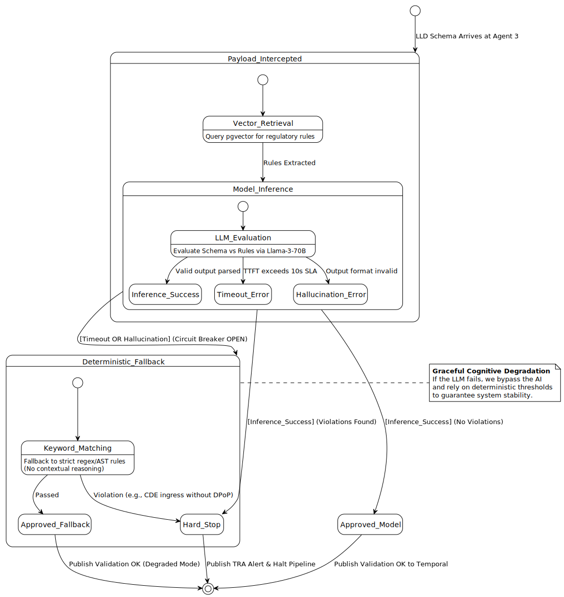

Part 1: System Codex - X_Bank Agent-Native Architecture
1.1 The Core Paradigm: Agent = Model + Harness + Specialization
At X_Bank, we establish a core design principle: Agent = Model + Harness + Bounded Specialization.

	•	The Model (Stateless Compute Cascades): A Mixture of Experts ranging from fast Small Language Models (SLMs) for basic reasoning to large foundation models for complex structural validation.
	•	The Harness (Cognitive Orchestration Layer): Deploys the physical infrastructure—including the Kong Agent Gateway, Multi-Agent Workflow Orchestrators (Temporal + Kafka), Persistent Memory Banks with write-filters, and strict WASM sandboxing.
	•	Harness Engineering (Enterprise Architecture): The software development and testing practices (Zero Trust SPIFFE IDs, Human-in-the-Loop workflows, GitOps via GitHub Actions and ArgoCD) used to design, govern, and audit this secure scaffolding.

1.2 Bounded Specialization (Agent Personas)
The five specific agent personas are mapped directly to X_Bank's organizational topology, strictly bounded by their roles:

Agent Persona
Structural Tier
Focus & Responsibility
Agent 1: Ingestion & Context Collector
Squad Tier
Continuous ingestion of Jira backlog streams, extracting HLD/LLD specs from Confluence via SLMs, and mapping domain boundaries to the BIAN reference architecture.
Agent 2: Infrastructure & Topology
Squad Tier
Translates logical contexts into LLD schema definitions, maps active database topologies, and designs intent-driven workflow patterns.
Agent 3: Regulatory Compliance Gate
Guild Tier
Acts as the Cognitive Security gate. Intercepts schemas, executes graceful degradation (circuit breakers) over vector embeddings (pgvector/Qdrant) containing CBUAE, PCI-DSS v4, and GDPR rules. Employs write-filters for Memory Banks.
Agent 4: HITL Governance Facilitator
Tribe Tier
Coordinates stakeholders via the Enterprise IdP based on role-based access controls (RBAC), managing mandatory Human-in-the-Loop approval workflows.
Agent 5: Cognitive Quality Auditor
Chapter Tier
Performs Semantic Triangle checks on running code and tracks Workload Amplification metrics via Autonomous Platform Automation (APA).

1.3 Master Architectural Artifact Index
All system behaviors, boundaries, and fallbacks are documented in our verified PlantUML files, which serve as the definitive design boundaries:
- **C4 System Context**: [c4_context_v2.puml](file:///Users/alicopur/Downloads/X_Bank%20Agentive-Architecture-Framework%20v2/x_bank-core/c4_context_v2.puml)

- **C4 Container**: [c4_container_v2.puml](file:///Users/alicopur/Downloads/X_Bank%20Agentive-Architecture-Framework%20v2/x_bank-core/c4_container_v2.puml)

- **C4 Component (Agent 3)**: [c4_component_v2.puml](file:///Users/alicopur/Downloads/X_Bank%20Agentive-Architecture-Framework%20v2/x_bank-core/c4_component_v2.puml)

- **Temporal Workflow (Sequence)**: [sequence_temporal_workflow_v2.puml](file:///Users/alicopur/Downloads/X_Bank%20Agentive-Architecture-Framework%20v2/x_bank-core/sequence_temporal_workflow_v2.puml)

- **Cognitive Circuit Breaker (State)**: [state_deterministic_fallback_v2.puml](file:///Users/alicopur/Downloads/X_Bank%20Agentive-Architecture-Framework%20v2/x_bank-core/state_deterministic_fallback_v2.puml)

