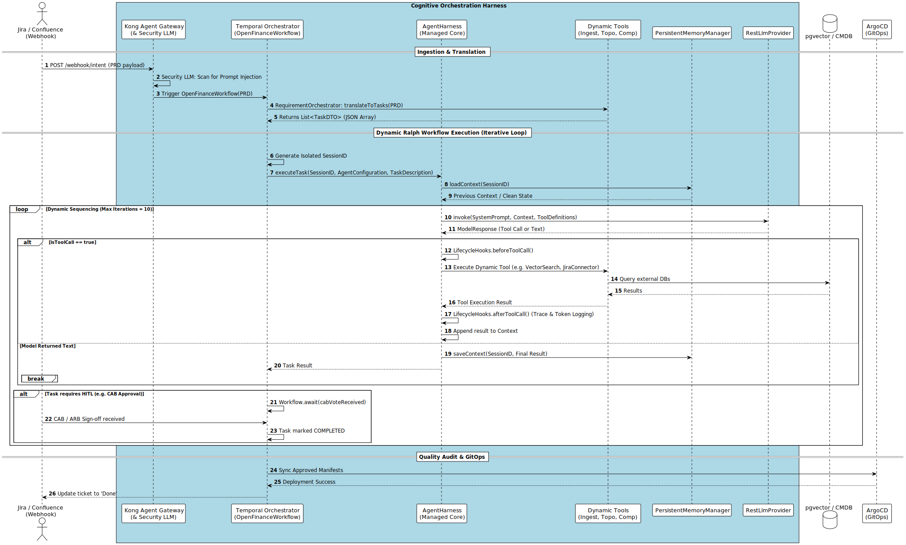

Part 3: High-Level Design (HLD) - X_Bank Agent-Native Architecture
3.1 Intent-Driven Multi-Agent Workflow
The multi-agent orchestrator operates as a stateful, long-running workflow system using Temporal + Apache Kafka (AWS MSK):

                  ┌──────────────────────────────┐

                  │        Jira Webhook          │

                  └──────────────┬───────────────┘

                                 │

                                 ▼

   ┌────────────────────────────────────────────────────────────┐

   │             COGNITIVE ORCHESTRATION HARNESS                │

   │                                                            │
   
   │            ┌───────────────────────────────┐               │
   
   │            │   Kong Agent Gateway & Security    │               │
   
   │            │   (Prompt Injection Filter &  │               │
   
   │            │    Semantic Vector Cache)     │               │
   
   │            └───────────────┬───────────────┘               │
   
   │                            │                               │
   
   │                            ▼                               │

   │   ┌───────────────┐          ┌───────────────┐             │

   │   │    Agent 1    │ ───────► │    Agent 2    │             │

   │   │  Ingestion &  │          │  Topology     │             │

   │   │  BIAN Mapping │          │  & LLD Schema │             │

   │   └───────────────┘          └───────┬───────┘             │

   │                                      │                     │

   │                                      ▼                     │

   │                              ┌───────────────┐             │

   │                              │    Agent 3    │             │

   │                              │  Compliance   │             │

   │                              │  Gate         │             │

   │                              └───────┬───────┘             │

   │                                      │ (If Valid)          │

   │                                      ▼                     │

   │   ┌───────────────┐          ┌───────────────┐             │

   │   │    Agent 5    │ ◄─────── │    Agent 4    │             │

   │   │  Cognitive    │          │  HITL Gov &   │             │

   │   │  Quality      │          │  Sign-offs    │             │

   │   └───────────────┘          └───────────────┘             │

   └────────────────────────────────────────────────────────────┘

*For a detailed programmatic view of this multi-agent state execution, please refer to the mandatory [Temporal Workflow Sequence Diagram](file:///Users/alicopur/Downloads/X_Bank%20Agentive-Architecture-Framework%20v2/x_bank-core/sequence_temporal_workflow_v2.puml).*

3.2 Workflow States and Operational Logic
	•	State 0: [Gateway Routing & Security]: Webhook hits the Kong Agent Gateway. The Security LLM layer scans for prompt injection. The Semantic Cache is checked to bypass full execution if this is a duplicated intent.
	•	State 1: [Jira Ingestion]: Ingestion of Jira backlog items. Agent 1 queries Confluence using Page ID references to retrieve storage formats, mapped via Model Cascades (SLM for simple parsing).
	•	State 2: [Doc & CMDB Context Assembly]: Agent 1 and Agent 2 assemble design contexts. Active topologies are extracted from CMDB GraphQL APIs to perform relational mapping.
	•	State 3: [Regulatory Validation & Graceful Degradation]: Agent 3 intercepts LLD schemas. Evaluates payloads for compliance via LLM cascades. If inference fails, it falls back to deterministic pgvector rules. Minor issues are auto-remediating; critical blocks trigger build failures. Memory writes are filtered to prevent Stored XSS.
	•	State 4: [Human-in-the-Loop & Verification]: Agent 4 maps permissions via Enterprise IdP, verifies voter roles (RBAC), and explicitly pauses the Temporal workflow pending mandatory human approval for sensitive architectural changes.
	•	State 5: [Slide Generation & Repo Sync]: Agent 4 compiles presentation decks and syncs approved architectural metadata to ArgoCD GitOps Git trees.
	•	State 6: [Zero Trust Incident Response (Kill Switch)]: If any agent behaves anomalously or breaches authorization, the CISO can trigger a hardware-level Kill Switch, instantly revoking the SPIFFE ID and freezing memory writes.
