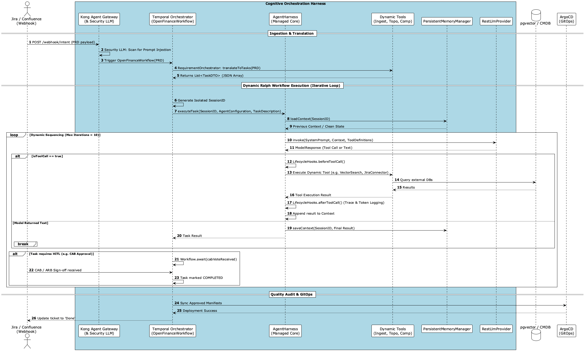
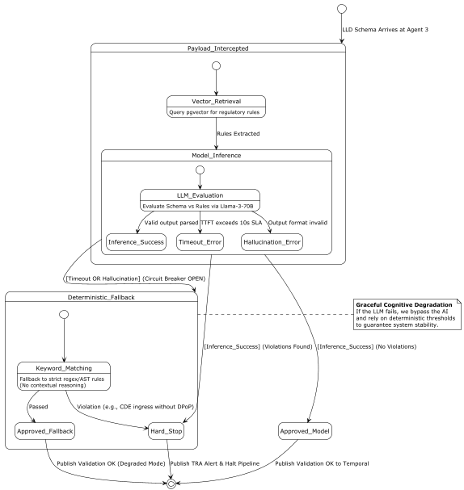
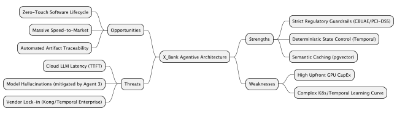

Part 8: TOGAF 10 Agile, Tech Radar, & Enterprise Governance - X_Bank Agent-Native Architecture
8.1 TOGAF 10 — Agile Practices Integration
Under TOGAF 10 agile practices, enterprise architecture is transformed from static, heavyweight documentation into an iterative, dynamic, and continuous feedback loop. The Cognitive Orchestration Harness achieves this by implementing:

	•	Cognitive Guardrails over Gatekeepers: Replacing manual design reviews with automated, intent-driven Multi-Agent workflows.
	•	Architecture-as-Code (AaC): Storing HLD/LLD configurations, ADRs, and BIAN-compliant metadata in the Git repository as machine-readable JSON schemas, allowing the architecture to evolve alongside code.

8.2 Agile Scrum & TOGAF Collaboration (Meetings in ADM & SDLC)
The framework integrates Agile Scrum ceremonies directly with the phases of the TOGAF Architecture Development Method (ADM):

                     ┌──────────────────────────────────────────────┐

                     │    Sprint Planning [Phase A/B/C/D]           │

                     │    - Agent 1 routes intents & maps BIAN      │

                     └──────────────────────┬───────────────────────┘

                                            │

                                            ▼

                     ┌──────────────────────────────────────────────┐

                     │    Daily Standup [Phase G - Gov]             │

                     │    - Agent 3 scans memory banks for drift    │

                     └──────────────────────┬───────────────────────┘

                                            │

                                            ▼

                     ┌──────────────────────────────────────────────┐

                     │    Sprint Review [Phase E/F - Solutions]     │

                     │    - Agent 4 executes HITL sign-offs         │

                     └──────────────────────┬───────────────────────┘

                                            │

                                            ▼

                     ┌──────────────────────────────────────────────┐

                     │    Sprint Retro [Phase H - Change Mgmt]      │

                     │    - Agent 5 computes APA & Workload Metrics │

                     └──────────────────────────────────────────────┘

	•	Sprint Planning (ADM Phase A: Vision / Phase B-D: BDAT Architecture):
	•	Process: Product owners approve PRDs via the Comala Workflow. The Blueprint Creator App transfers values to a structured table.
	•	Agent Action: Agent 1 (Ingestion) intercepts this event, maps capabilities to BIAN boundaries using SLMs, and checks Jama Software for previous capability reuse. Programmatic Jira backlog cards are generated, preventing redundant engineering.
	•	Daily Standup (ADM Phase G: Implementation Governance):
	•	Process: Engineers execute commits on feature branches.
	•	Agent Action: In the CI/CD pipeline, Agent 3 (Regulatory Gate) and Agent 5 (Cognitive Quality) run continuous scans. If any code bypasses CDE boundaries or introduces raw PII in logging targets, a pipeline hard-stop is triggered, and a TRA is generated, instantly alerting the team during standup.
	•	Sprint Review & Demo (ADM Phase E: Opportunities & Solutions / Phase F: Migration Planning):
	•	Process: Deploying working software increments to standard staging environments.
	•	Agent Action: Agent 4 manages the Human-in-the-Loop workflows, pausing execution until stakeholders formally approve the logical drift. Agent 5 executes a Semantic Triangle Check.
	•	Mandatory Board Artifacts: The workflow requires explicit review of the Intent-Driven Sequence UML (`sequence_temporal_workflow_v2.puml`) and Cognitive Circuit Breaker State Diagram (`state_deterministic_fallback_v2.puml`) before IdP CAB sign-off is permitted.

	•	Sprint Retrospective (ADM Phase H: Architecture Change Management):
	•	Process: Analyzing team velocity, quality, workload amplification, and technical debt.
	•	Agent Action: Agent 5 computes Workload Amplification metrics and SRE bottleneck summaries to optimize Autonomous Platform Automation (APA). Simultaneously, our Debt Management Engine calculates code-quality debt scores to automatically insert refactoring cards into the next sprint's backlog.

### 8.3 X_Bank Enterprise Tech Radar

| **ADOPT** (Standard Production Use) | **TRIAL** (Sandbox / Pilots) | **ASSESS** (Proof of Concept) | **HOLD** (Deprecated / Decommissioning) |
| :--- | :--- | :--- | :--- |
| Temporal Workflows | Security LLM Gateway | gVisor K8s runtimes | Static Temporal Workflows |
| SPIFFE ID Zero Trust | WASM Sandboxed Agents | Braintrust AI Tracing | Plaintext PII Logs |
| Vector DBs (`pgvector`) | Semantic Vector Caching | DPoP Token-Bindings | Unencrypted S3 Buckets |
| Fast SLMs (Local Compute) | | | |

8.4 Debt Management & Strategic Decision Helper
8.4.1 Business Vertical Follow-up
Our agents track capabilities across our three primary business verticals: Corporate Banking, Retail Payments, and Open Wealth. This provides the C-level and business leads with immediate visibility into the technical status, Cognitive Security posture, and regulatory compliance posture of each line of business.
8.4.2 Debt Management Engine
The Debt Management Engine programmatically audits the repository, calculating an overall Technical Debt Index (TDI): $$\text{TDI} = \sum (\text{Component Complexity} \times \text{Risk Weight})$$

	•	Identified Debt (Cards Domain): Monolithic co-located tables with direct Oracle DB schema couplings are assigned a Critical Risk Weight (1.0).
	•	Action Plan: The engine automatically creates an epic card in Jira labeled TECH-DEBT-REFACTOR to prioritize Strangler Fig decoupling tasks.
8.4.3 Strategic Decision Helper (Build vs. Buy alternative matrix)
For newly proposed services, the agent utilizes a weighted trade-off analysis matrix:

Evaluation Factor
Weight
Build Custom (e.g., custom Proxy)
Buy Commercial (e.g., Datadog LLM)
Recommendation
Sovereignty Compliance
30%
3 (100% Private VPC)
1 (Public SaaS endpoint)
Build Custom is selected
API Customization
20%
3 (High, spring-based)
2 (Limited partner API)
Due to strict CBUAE data
Operational SLA
25%
2 (In-house SRE load)
3 (Cloud provider backed)
residency mandates, cloud
Total Cost (3yr TCO)
25%
3 (Low licensing fee)
1 (High SaaS seat pricing)
hosting must remain local.
Weighted Score
100%
2.75
1.70

### 8.4.4 CapEx vs. OpEx: 3-Year Total Cost of Ownership (TCO)

To secure CAB approval for large-scale AI deployment, the Agent 4 Governor validates projected infrastructure against this standard Hybrid-Cloud financial model.

#### **CapEx (Capital Expenditures) - Upfront Investments**
| Component | Rationale | Est. 3-Year Cost | Impact Level |
| :--- | :--- | :--- | :--- |
| **AWS EKS GPU Reserved Instances (RIs)** | 3-Year upfront commitment for `p4d.24xlarge` GPU nodes running localized LLaMA-3 models. | **$315,000** | High Upfront. Eliminates unpredictable per-token SaaS pricing. |
| **Temporal Enterprise License** | Upfront enterprise licensing for high-availability multi-agent worker orchestration. | **$85,000** | Moderate Upfront. |
| **Kong API Gateway Enterprise** | Licensing for advanced Security LLM plugins (Prompt Injection filtering). | **$60,000** | Moderate Upfront. |
| **Integration Architecture Setup** | One-time development cost for Kafka CDC and BIAN domain mapping. | **$120,000** | High Upfront. |

#### **OpEx (Operational Expenditures) - Ongoing Run Costs**
| Component | Rationale | Est. Monthly Cost | Impact Level |
| :--- | :--- | :--- | :--- |
| **AWS MSK (Managed Kafka)** | Pay-as-you-go event streaming for asynchronous agent orchestration. | **$2,500/mo** | Scales linearly with message throughput. |
| **AWS RDS PostgreSQL (pgvector)** | Ongoing storage and read-replica compute for the Semantic Vector Cache. | **$800/mo** | Predictable, low monthly cost. |
| **CI/CD Pipeline Compute** | GitHub Actions / ArgoCD runner minutes for executing Semantic Triangle Checks. | **$300/mo** | Pay-per-minute, minimal cost. |
| **Token Fallback APIs (Emergency)** | Metered token consumption for emergency Cloud LLM fallbacks if local cluster degrades. | **$1,500/mo** | Highly volatile. Strictly capped by budget alarms. |

> [!WARNING]
> By purchasing upfront AWS RIs (**CapEx**), we heavily reduce the long-term operational cost of LLM inference (**OpEx**). If we relied purely on SaaS LLM tokens (e.g., OpenAI/Anthropic), the high volume of LLD architecture scans by Agent 3 would result in unbounded, catastrophic OpEx scaling over a 3-year term.

8.5 Software AG Alfabet & CMDB CDC Integration
8.5.1 API-Driven Alfabet Updates
Our Enterprise Architecture is fully integrated with Software AG Alfabet to prevent "design drift":

	•	Upon a successful ArgoCD GitOps deployment sync, Agent 4 triggers a POST payload to Software AG Alfabet REST APIs:
	•	POST /alfabet/api/v2/applications/{appId}/interfaces
	•	The payload registers the updated active API gateway endpoints, BIAN service mappings, and schemas directly in the enterprise catalog, automating standard TOGAF ADM Phase G reporting.
8.5.2 CMDB Change Data Capture (CDC) Synchronization
To keep our logical model aligned with physical runtime assets, we implement a Change Data Capture (CDC) loop:

	•	CMDB Updates: Any physical infrastructure changes (e.g., new container node groups or RDS read-replicas) are captured on the CMDB (ServiceNow) layer.
	•	Event Broadcast: The CMDB publishes a CDC event to the Apache Kafka cmdb-cdc-updates topic.
	•	Agent Reconciliation: Agent 5 consumes this event and runs a Semantic Triangle Check comparing the newly detected physical resources with our logical Git-driven HLD schemas. Any unauthorized modifications are logged as "Drift Deviations" in our Tech Radar.

### 8.6 Strategic SWOT Analysis
To ensure executive alignment, Agent 4 validates the strategic risk posture of the architecture against the following matrix:

| **Strengths** (Internal) | **Weaknesses** (Internal) |
| :--- | :--- |
| - Strict Regulatory Guardrails (CBUAE/PCI-DSS) - Deterministic State Control (Temporal) - High-Speed Semantic Caching | - High Upfront GPU CapEx - Complex K8s/Temporal Learning Curve |

| **Opportunities** (External) | **Threats** (External) |
| :--- | :--- |
| - Zero-Touch Software Lifecycle - Massive Speed-to-Market - Automated Artifact Traceability | - Cloud LLM Latency (TTFT) - Model Hallucinations (mitigated by Agent 3) - Vendor Lock-in (Kong/Temporal) |
