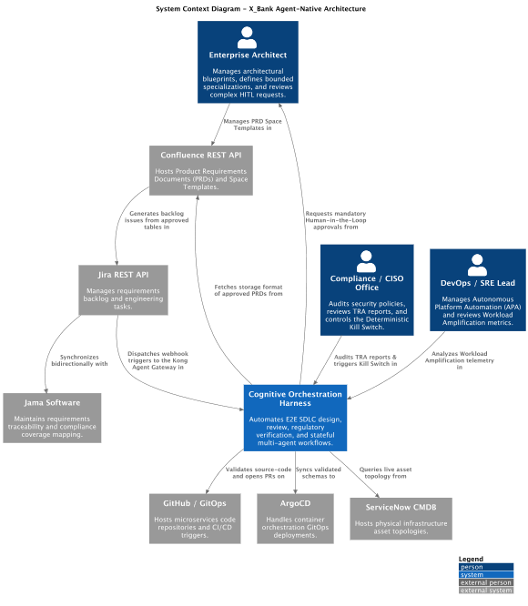
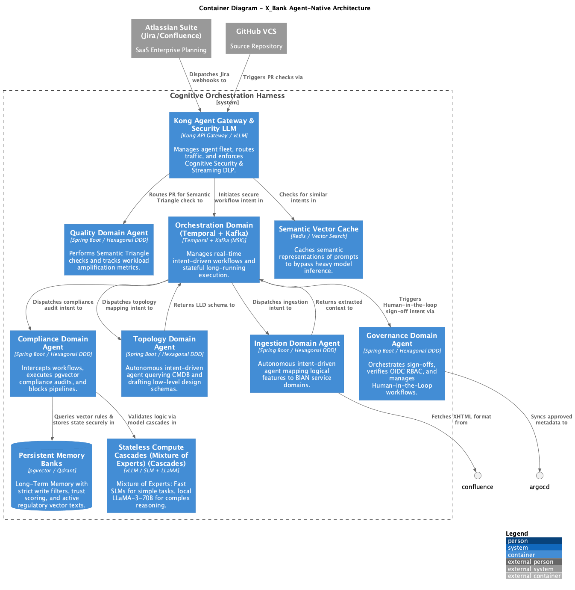

High-Level Design (HLD) Document - X_Bank Agent-Native Architecture Framework
Document Identifier: RB-EAF-2026-HLD
Classification: RESTRICTED - ENTERPRISE ARCHITECTURE
Target Audience: CAB/ARB Board, Solutions Architects, DevSecOps Leads
Version: 1.0

1. Executive Summary & Core Philosophy
**Mission**: Automate E2E SDLC design, regulatory review, and code reconciliation under CBUAE, PCI-DSS, and GDPR standards.
1.1 The Harness Engineering Principle: Agent = Model + Harness
**Agent = Model + Harness + Bounded Specialization**
LLMs act as stateless compute, secured by Kong, Kafka, and PostgreSQL.
1.2 The LFI-Sandwich Architecture Tiers
	•	The Upper Layer: Business and product requirements established in Confluence and Jira.
	•	The Middle Layer: Logical design and low-level specifications aligned with the BIAN framework.
	•	The Lower Layer: Comprehensive post-processing compliance validation, automated remediation, and code auditing.

### 1.3 Deployment Tiers & Network Flow Matrix

| Tier Zone | Network Placement | Core Technologies | Function |
| :--- | :--- | :--- | :--- |
| **Ingestion Edge** | DMZ (Public facing) | Kong Gateway, Security LLM | Validates JWTs, intercepts Prompt Injections via Streaming DLP. |
| **Orchestration Core** | Private VPC | Temporal Enterprise, AWS MSK | Maintains distributed transaction state and async worker events. |
| **Secure Compute** | EKS GPU Nodes | vLLM (LLaMA-3), gVisor/WasmEdge | Executes strict, sandboxed LLM generations isolated from internet. |
| **Master Storage** | Private RDS Subnet | PostgreSQL (`pgvector`), Redis | Caches semantic similarities to bypass LLM inference (TTFT mitigation). |

2. System Context (C4 Level 1)
The System Context diagram describes how the Cognitive Orchestration Harness interacts with users (Architects, CISO, SREs) and external enterprise systems.
2.1 Context Diagram
	•	Source PUML File: c4_context.puml
	•	Rendered Diagram: diagrams/c4_context.svg

[Enterprise Architect] ────► [Confluence (Approved PRDs)] ────► [Jira Backlog] ───► [Jama Traceability]

         │                                                            │

         └────────────────────────────────────────────────────────────┼──────────┐

                                                                      ▼          ▼

[Compliance/CISO] ◄───────────────────────────────────────► [Cognitive Orchestration Harness]

                                                                      │

                                                                      ▼

[DevOps / SRE] ◄────────────────────────────────────────── [GitHub / ArgoCD GitOps]

3. Container Architecture (C4 Level 2)
The Container diagram decomposes the Cognitive Orchestration Harness into its core container modules, event buses, databases, and localized LLM compute engines.
3.1 Container Diagram
	•	Source PUML File: c4_container.puml
	•	Rendered Diagram: diagrams/c4_container.svg

3.2 Containers Description
	•	Agent 1 (Ingestion Service): Java/Spring Boot container that polls Jira webhooks, pulls Confluence XHTML formats, and aligns logical features to BIAN service domains.
	•	Agent 2 (Topology Mapper): Java/Spring Boot container that queries CMDB GraphQL APIs to map live network, database, and application topologies.
	•	Agent 3 (Compliance Scoper Gate): The regulatory gate container. Performs semantic rule matching over pgvector and localized LLaMA reasoning models.
	•	Agent 4 (Governance Facilitator): Manages RBAC-driven voting, sign-offs, notifications, and slides compilation.
	•	Agent 5 (SWE Chapter SRE): Runs Semantic Triangle checks and tracks anonymized DORA metrics.
	•	Apache Kafka (AWS MSK): The decoupled messaging backbone routing event streams.
	•	Sovereign LLM (vLLM): Private, localized LLaMA-3-70B compute engine running on AWS EKS GPU nodes inside our trust boundary.

4. Component Architecture - Agent 3 (C4 Level 3)
The Component diagram models the internal Spring Boot and pgvector components of our regulatory gate (Agent 3).
4.1 Component Diagram
	•	Source PUML File: c4_component.puml
	•	Rendered Diagram: diagrams/c4_component.svg
4.2 Component Descriptions
	•	Kafka Consumer: Consumes LLD schemas from the lld-generation-topic topic.
	•	Vector Rule Scanner: Performs cosine-similarity searches against the pgvector active rules database.
	•	Regulatory Validator Core: Orchestrates evaluations and coordinates decisions (Remediate, Hard-Stop, Pass).
	•	Log Sanitizer Remediator: Programmatically injects sanitization dependency libraries into microservice builds.
	•	Compliance Hard-Stop Manager: Halts CI/CD pipelines and locks target ArgoCD branches upon critical violations.
	•	TRA Report Generator: Automatically generates PDF Targeted Risk Analysis reports.
	•	Kafka Publisher: Emits final decisions and alerts to the compliance-alerts topic.

5. Master Data Tier Schemas (PostgreSQL)
5.1 Account Service Schema
CREATE TABLE tbl_accounts (

    id UUID PRIMARY KEY DEFAULT gen_random_uuid(),

    account_number VARCHAR(34) UNIQUE NOT NULL, -- IBAN Format

    balance NUMERIC(18,2) NOT NULL DEFAULT 0.00,

    customer_id UUID NOT NULL,

    currency VARCHAR(3) NOT NULL,

    status VARCHAR(10) NOT NULL CHECK (status IN ('ACTIVE', 'SUSPENDED', 'CLOSED'))

);
5.2 Card Service Schema (PCI-DSS v4 Isolated CDE)
CREATE TABLE tbl_cards (

    id UUID PRIMARY KEY DEFAULT gen_random_uuid(),

    card_token VARCHAR(64) UNIQUE NOT NULL, -- SHA-256 Masked PAN representation

    expiry_date VARCHAR(5) NOT NULL, -- MM/YY

    status VARCHAR(10) NOT NULL DEFAULT 'ACTIVE',

    credit_limit NUMERIC(15,2) NOT NULL DEFAULT 0.00

);

6. Multi-Agent Temporal Sequence
The system orchestrates intent across 5 different agents via the Temporal worker pattern. 
*For the exhaustive step-by-step API call trace, please refer to the [Temporal Workflow Sequence Diagram](file:///Users/alicopur/Downloads/X_Bank%20Agentive-Architecture-Framework%20v2/x_bank-core/sequence_temporal_workflow_v2.puml).*

